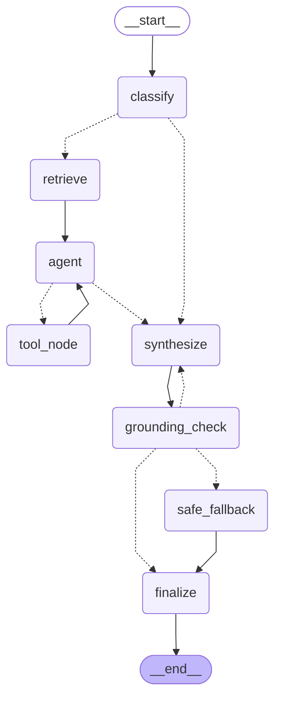

# Agent graph

Generated by `python -m app.agent.graph` from the compiled LangGraph `StateGraph` (`graph.get_graph().draw_mermaid()`). See capstonespec.md §B9.1 for what each node does.

```mermaid
---
config:
  flowchart:
    curve: linear
---
graph TD;
	__start__([<p>__start__</p>]):::first
	classify(classify)
	retrieve(retrieve)
	agent(agent)
	tool_node(tool_node)
	synthesize(synthesize)
	grounding_check(grounding_check)
	safe_fallback(safe_fallback)
	finalize(finalize)
	__end__([<p>__end__</p>]):::last
	__start__ --> classify;
	agent -.-> synthesize;
	agent -.-> tool_node;
	classify -.-> retrieve;
	classify -.-> synthesize;
	grounding_check -.-> finalize;
	grounding_check -.-> safe_fallback;
	grounding_check -.-> synthesize;
	retrieve --> agent;
	safe_fallback --> finalize;
	synthesize --> grounding_check;
	tool_node --> agent;
	finalize --> __end__;
	classDef default fill:#f2f0ff,line-height:1.2
	classDef first fill-opacity:0
	classDef last fill:#bfb6fc
```
